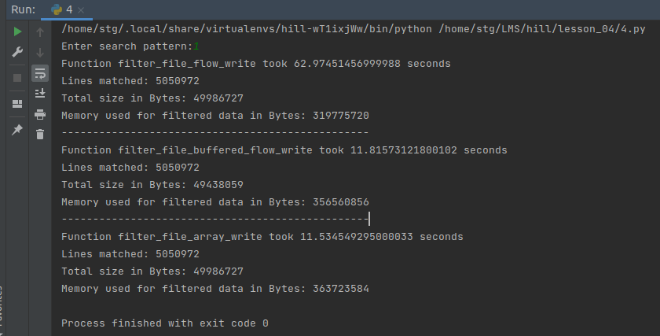
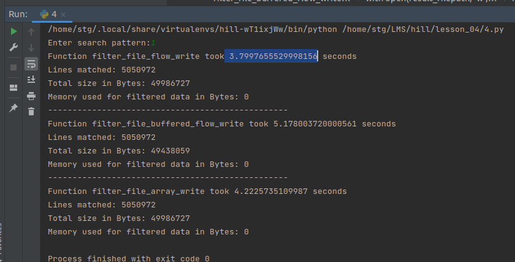

# hill

P.S.

Homework lesson 04:

Filtering rockyou.txt based on user input.
* filtered file location: <project_root>/losson_04/data/filtered/<search_pattern>.txt

There's some metrics, about Pympler's asizeof method.

The size of memory used for data read from txt file is different (tha's interesting and unclear, but it may be my mistake).
The only difference in all filter methods is how data stored before writing to the new file.
####<u>Please pay attention for line "Memory used for filtered data:"</u> As I realized, "asizeof" is very CPU-time expensive method.

###- Launch with memory profiling

### - Launch without memory profiling

